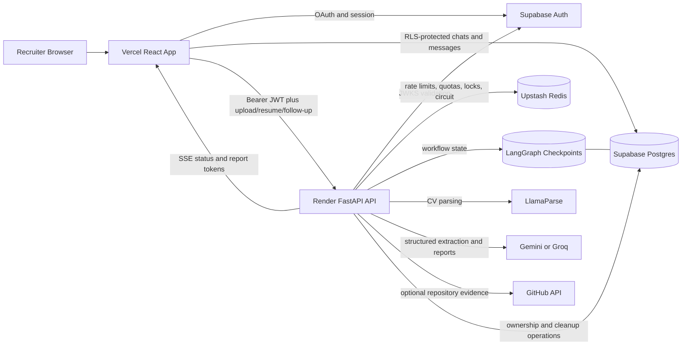

# DevSelect Architecture

This document explains the current DevSelect design, the main request flows, and the changes needed for larger-scale use. It describes the repository as implemented; proposed improvements are labeled separately.

## System Diagram



## Main Components

| Component | Responsibility |
| --- | --- |
| React frontend | Authentication UI, chat history, file selection, report rendering, follow-up UX |
| Supabase Auth | Google/GitHub OAuth, browser sessions, signed access tokens |
| Supabase Postgres | User chats/messages, RLS policies, indexes, transient LangGraph checkpoints |
| FastAPI backend | JWT verification, ownership checks, upload validation, workflow orchestration, safe errors |
| LangGraph workflow | Agent routing, interruption for GitHub selection, checkpointed evaluation state |
| LlamaParse | PDF-to-text extraction for accepted CV files |
| Gemini/Groq | Structured CV extraction, GitHub analysis, final report, follow-up answers |
| GitHub API | Optional public repository/profile evidence for applicable technical candidates |
| Upstash Redis | Shared rate limits, quotas, duplicate locks, circuit state |

## Trust Boundaries

The browser is an untrusted client. It receives only public Supabase configuration and sends a Supabase access token to protected backend routes. The backend validates the token and derives the user ID from the verified `sub` claim; it does not accept a body-supplied user ID as identity.

The frontend can read and write only reviewed columns in `chats` and `messages`. Supabase RLS applies ownership rules, while column-level grants keep backend-owned fields such as `thread_id` and `candidate_embedding` out of browser control.

Provider keys, Redis credentials, the service-role key, and the Postgres checkpoint connection stay on the backend. Checkpoint tables have no browser policies or grants.

## Request Flow

### Authentication and chat history

1. The recruiter signs in through Supabase OAuth.
2. Supabase returns a browser session; the React auth hook restores it on refresh.
3. The frontend queries `chats` and `messages` directly with the anon key plus the authenticated session.
4. RLS filters rows to the current `auth.uid()`.
5. New chats, titles, pins, and messages use only the browser-writable columns granted by the database migrations.

This split keeps ordinary history reads responsive while reserving privileged workflow behavior for FastAPI.

### Protected backend request

1. The frontend reads the current Supabase session and sends `Authorization: Bearer <access-token>`.
2. FastAPI selects an allowed asymmetric algorithm and verifies the token against Supabase JWKS.
3. Issuer, audience, expiry, issued-at, and UUID subject claims are validated.
4. The requested `chat_id` is loaded through the backend Supabase client and checked against the verified user ID.
5. For resume and stream calls, the stored backend-owned `thread_id` must also match.

## CV Upload Flow

```text
Select PDF in browser
  -> create/persist chat and upload message
  -> POST /api/chat/{chat_id}/upload
  -> JWT + chat ownership
  -> rate limit + circuit + quota + duplicate lock
  -> bounded file read
  -> MIME + extension + PDF magic + structure checks
  -> encrypted/page-count/CV-likeness checks
  -> create checkpointed workflow state
  -> return 200 for direct evaluation
     or 202 when multiple GitHub profiles need recruiter selection
```

The backend accepts PDF uploads up to 10 MB and validates the file independently of its filename. It uses a bounded in-memory read, a sanitized display filename, structural parsing, a page limit, and temporary-file cleanup. Raw PDFs are not stored in chat messages or object storage.

If the extracted candidate domain is non-technical or unclear, the workflow can continue with CV-only evidence. Technical candidates with one relevant GitHub URL continue through GitHub analysis. Multiple profiles pause the graph and return a selector payload for recruiter input.

## Evaluation and Resume Flow

The graph is:

```text
START
  -> Agent 1: parse CV and extract structured candidate evidence
  -> route:
       no GitHub review needed -> Agent 3
       one GitHub profile       -> Agent 2 -> Agent 3
       multiple profiles        -> interrupt -> /resume -> Agent 2 -> Agent 3
  -> END
```

Agent responsibilities:

- **Agent 1:** parses the accepted PDF, caps model input, extracts candidate fields, determines role/domain, and decides whether GitHub review is appropriate.
- **Agent 2:** inspects selected public GitHub evidence and returns a structured technical evidence summary.
- **Agent 3:** combines the available evidence into the final hiring report.

LangGraph's Postgres checkpointer stores resumable workflow state. The `thread_id` is generated and managed by the backend. A unique partial database index prevents one non-null thread from being attached to multiple chats.

## SSE Flow

1. The frontend receives `thread_id` and a bounded resume payload from `/upload` or `/resume`.
2. It opens `GET /api/chat/{chat_id}/stream` with the access token.
3. The backend rechecks user ownership and the chat/thread binding.
4. A Redis-backed claim prevents concurrent evaluation streams for the same run.
5. The backend emits named SSE events:
   - `meta` for candidate display metadata
   - `status` for progress labels
   - `token` for incremental report text
   - `done` when the report is complete
   - `error` with a stable public code and sanitized message
6. The frontend builds the report incrementally and persists the completed assistant message.
7. The backend marks terminal state, releases locks, and purges terminal checkpoints.

SSE is a good fit because the product needs one-way incremental delivery, automatic browser-friendly streaming semantics, and no bidirectional socket protocol.

## Follow-Up Flow

1. A plain text message sent after a completed report is treated as a follow-up.
2. FastAPI verifies JWT ownership and loads the persisted final report from the user's chat messages.
3. Redis atomically enforces per-evaluation and per-user follow-up limits.
4. The model receives bounded saved-report context and the bounded recruiter question.
5. The answer streams over `POST /api/chat/{chat_id}/follow-up/stream`.
6. The frontend persists the completed answer as a typed assistant message.

Follow-up prompts explicitly treat user text as untrusted input, do not rerun the evaluation, and allow clearly labeled evidence-scope hypotheticals without rewriting the official saved report.

## Data Model Summary

### `public.chats`

Primary fields include:

- `id`: UUID primary key
- `user_id`: owner, referencing `auth.users`
- `title`: recruiter-visible chat title
- `thread_id`: backend-owned workflow binding
- `created_at`, `updated_at`: ordering timestamps
- `candidate_embedding`: backend-owned vector field
- `is_pinned`, `pinned_at`: sidebar state

RLS checks `user_id = auth.uid()`. Browser inserts are limited to `user_id` and `title`; browser updates are limited to title/activity/pin fields.

### `public.messages`

Primary fields include:

- `id`: UUID primary key
- `chat_id`: parent chat with cascade delete
- `role`: `user`, `assistant`, or `status`
- `content`: recruiter text, upload metadata, report, follow-up, or safe error content
- `created_at`: ordering timestamp
- `message_type`: typed assistant-message metadata

RLS uses an `EXISTS` check against the parent chat owner. The browser can read and insert reviewed columns but cannot update or directly delete messages.

### Checkpoint tables

`checkpoints`, `checkpoint_blobs`, `checkpoint_writes`, and `checkpoint_migrations` are created and used by `AsyncPostgresSaver`. They are backend-only, have RLS enabled, and expose no anon/authenticated policies or grants.

Core indexes cover chat ownership/history ordering, message ordering, and unique non-null `thread_id` values.

## Runtime and Deployment

- Vercel serves the static Vite frontend and rewrites BrowserRouter routes to `index.html`.
- Render builds `backend/Dockerfile` and runs one non-root Uvicorn worker.
- The FastAPI lifespan opens an async Postgres pool, verifies checkpointer setup, builds the graph, and starts checkpoint TTL cleanup.
- Supabase hosts auth, app data, RLS, and checkpoint tables.
- Upstash provides shared safety state that survives process restarts and supports multiple API instances.

One worker is intentional for the current portfolio deployment. It avoids pretending that in-process stream guards are a complete horizontal-scaling mechanism; Redis remains the distributed control point.

## What Breaks at Scale

The current architecture is appropriate for a controlled portfolio beta, not 10,000 concurrent recruiters. Pressure points are:

- Long model calls occupy web-service tasks and open SSE connections.
- Provider quotas and latency dominate end-to-end throughput.
- The Render web process performs orchestration and delivery instead of delegating durable jobs.
- A Postgres pool sized for a small service will become a concurrency bottleneck.
- Direct browser chat queries need pagination and careful query plans as histories grow.
- Per-character SSE output adds avoidable event overhead for large reports.
- Operational visibility is currently lighter than a multi-tenant production service needs.
- Chat/report retention and candidate-data governance need formal product policies.

## Scaling to 10,000 Recruiters

A production-scale version would evolve in stages:

1. **Separate admission from execution.** Keep FastAPI for auth, validation, and job creation; enqueue accepted evaluations in a durable queue.
2. **Add worker pools.** Run parsing, GitHub review, and model evaluation in independently scalable workers with idempotent job IDs.
3. **Persist explicit job state.** Store status, progress, retry policy, and terminal errors outside the web process. SSE then subscribes to state rather than owning execution.
4. **Strengthen distributed controls.** Keep Redis locks and quotas, add tenant plans, reserve capacity atomically, and reconcile usage after completion.
5. **Scale data access.** Use managed connection pooling, pagination, retention jobs, reviewed indexes, and query monitoring.
6. **Control provider risk.** Add provider-specific concurrency pools, fallback policy, spend alerts, and load-shed behavior before queues grow without bound.
7. **Improve delivery.** Batch report chunks, support reconnectable streams, and consider a managed event layer if connection counts require it.
8. **Add observability.** Trace each evaluation by safe hashed IDs across upload, queue, workers, providers, persistence, and streaming.
9. **Formalize privacy.** Define deletion SLAs, provider retention settings, data-region requirements, audit trails, and candidate consent workflows.
10. **Prove capacity.** Run staged load tests with fake documents and mocked providers before increasing public limits.

The core boundaries can remain: browser-safe Supabase access, a JWT-protected API, backend-only providers, RLS data isolation, and distributed Redis safety. The largest change is moving expensive evaluation execution out of the web request lifecycle.
